# SWI - Rapport - Laboratoire 1

> Auteurs: Jean-Luc Blanc & Noémie Plancherel
>
> Date: 31.03.22

## Deauthentication attack

**Question** : quel code est utilisé par aircrack pour déauthentifier un client 802.11. Quelle est son interpretation ?

Le code utilisé par aircrack pour déauthentifier est le "-0". Ce code représente le "deauthentication attack mode". Ci-dessous, la commande aircrack pour pouvoir déauthentifier un client:

```sh
 aireplay-ng -0 1 -a 00:14:6C:7E:40:80 -c 00:0F:B5:34:30:30 ath0
```

- `-0` signifie déauthentification
- `1` est le nombre de "deauths" à envoyer, `0` en envoie continuellement
- `-a 00:14:6C:7E:40:80` est l'adresse MAC de l'AP
- `-c 00:0F:B5:34:30:30` est l'adresse du client à déauthentifier, si aucun paramètre n'est précisé, tous les clients de l'AP sont déconnectés
- `ath0` est le nom de l'interface

**Question** : A l'aide d'un filtre d'affichage, essayer de trouver d'autres trames de déauthentification dans votre capture. Avez-vous en trouvé d'autres ? Si oui, quel code contient-elle et quelle est son interpretation ?

Nous pouvons ci-dessous voir deux captures Wireshark avec des trames de déauthentification. Une trame avec le code 03, `Station is leaving (or has left) IBSS or ESS` et une autre avec le code 07, `Class 3 frame received from nonassociated station`.

Le code 3 indique que l'AP s'est déconnecté et a déhauthentifié le client.

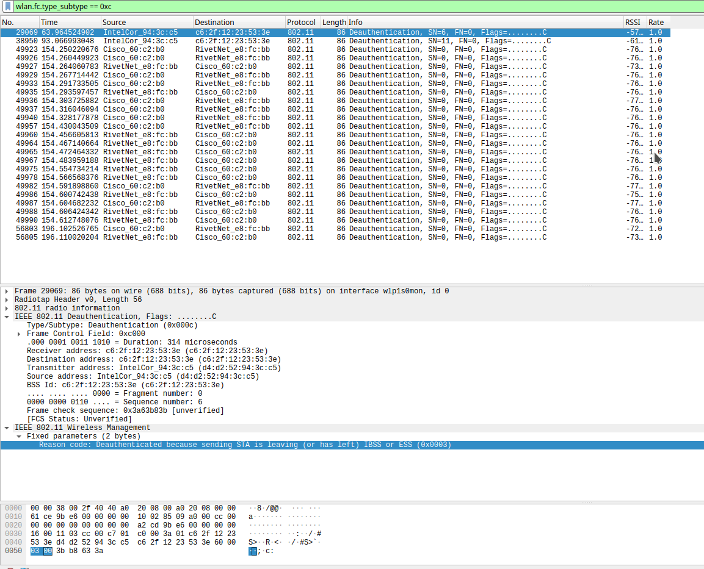

Le code 7 indique qu'une station a tenté de transférer des données vers l'AP avant leur association.

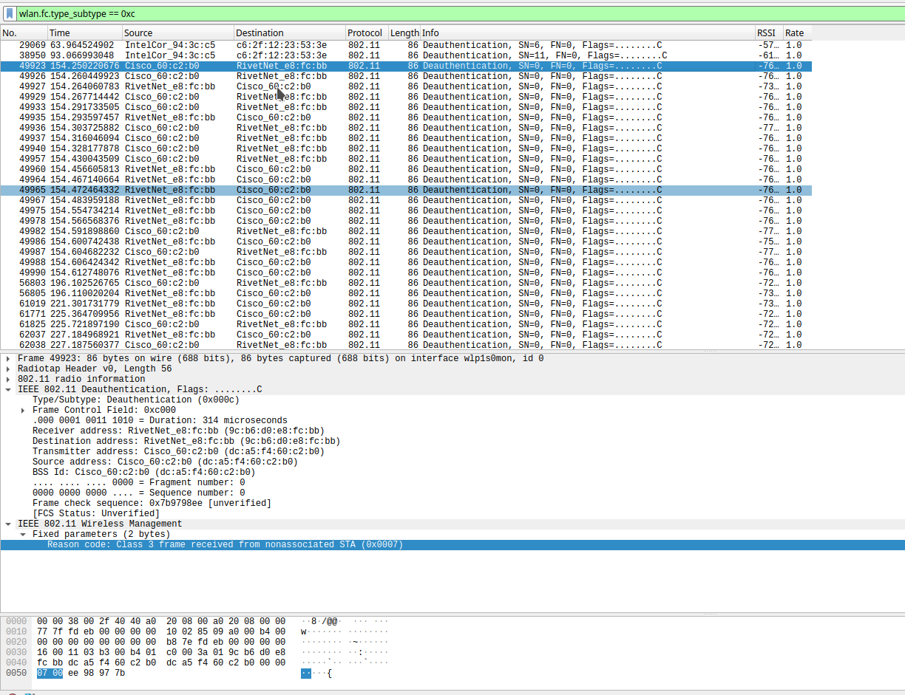

b) Développer un script en Python/Scapy capable de générer et envoyer des trames de déauthentification. Le script donne le choix entre des Reason codes différents (liste ci-après) et doit pouvoir déduire si le message doit être envoyé à la STA ou à l'AP :

- 1 - Unspecified
- 4 - Disassociated due to inactivity
- 5 - Disassociated because AP is unable to handle all currently associated stations
- 8 - Deauthenticated because sending STA is leaving BSS

**Question** : quels codes/raisons justifient l'envoi de la trame à la STA cible et pourquoi ?

Les raisons **4** et **5** car la raison 4 indique le délai d'expiration de la session client et la raison 5 indique que l'AP n'est pas disponible à l'instant. La station cliente n'est pas censée connaître ces deux informations lorsqu'elle souhaite se connecter ou lorsqu'elle est déjà connectée, c'est pourquoi c'est directement l'AP qui envoie les trames de déhautentification.

**Question** : quels codes/raisons justifient l'envoi de la trame à l'AP et pourquoi ?

Les raison **1** et **8** car la raison 1 n'a pas vraiment de justification et la raison 8 indique que c'est la station client elle-même qui se déconnecte.

**Question** : Comment essayer de déauthentifier toutes les STA ?

En précisant l'adresse de broadcast comme target `ff:ff:ff:ff:ff:ff`

**Question** : Quelle est la différence entre le code 3 et le code 8 de la liste ?

Le code 8 est pour BSS (Basic Service Set) et le code 3 est pour IBSS (Independant Basic Service Set) et ESS (Extended Service Set). Ces 3 paramètres sont les 3 configurations possibles d'un réseau sans-fil et ils fonctionnent les 3 de manière différente.

**Question** : Expliquer l'effet de cette attaque sur la cible

La cible se retrouve déconnectée du réseau sans fil dû à la récéption de trames de déhauthentification.

------

**Fonctionnement**

Nous avons choisi d'ajouter la cible, l'AP ainsi que l'interface en arguments du script python. Il y a également 3 autres paramètres optionnels:

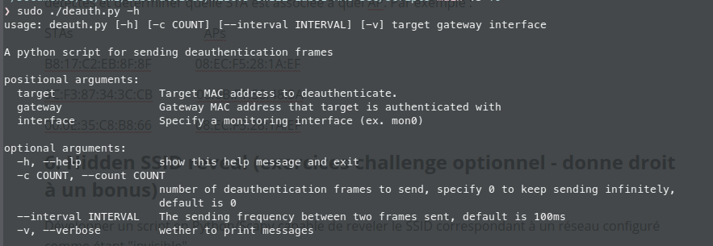

Afin de récupérer les informations que l'on a besoin, nous pouvons exécuter la commande `sudo airodump-ng wlp1s0mon` afin de visualiser tout le trafic de l'interface et de sélectionner la cible.

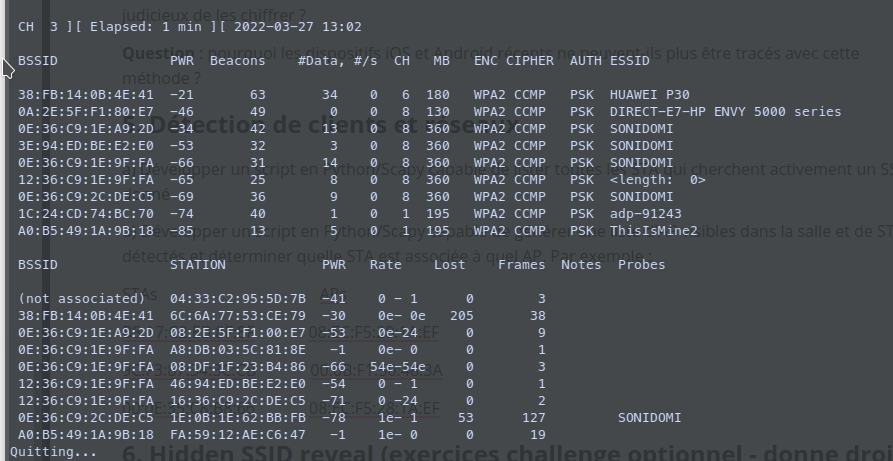

Nous allons séléctionner la cible `6C:6A:77:53:CE:79` qui est associé avec l'AP `HUAWEI P30`. 


Nous allons déconnecter la station de l'AP en envoyant des trames de déhauthentification avec le reason code 1. Ci-dessous, nous pouvons constater que le script fonctionne correctement.

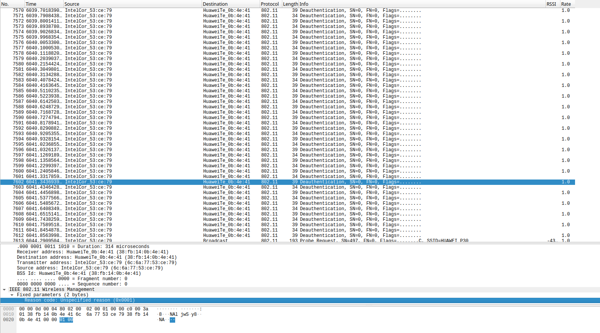

## Fake channel evil twin attack

__Question__ : Expliquer l'effet de cette attaque sur la cible

L'attaque va créer un faux point d'accès sur un nouveau channel en se basant sur un réseau qui existe déjà. Cela va permettre de spoofer l'AP et de récupérer du trafic privé d'utilisateurs comme des mots de passe.

------

**Fonctionnement**

Nous avons décidé d'ajouter l'interface comme argument du script:


Ainsi, pour lancer l'attaque, on effectue la commande suivante:

```sh
sudo ./fake_channel.py wlp1s0mon
```

Une fois le script lancé, une liste des SSID à proximité, avec une recherche active, s'affichera pendant quelques secondes. L'utilisateur pourra ensuite choisir le réseau à attaquer en entrant le BSSID voulu. Finalement, les paquets du beacon concurrent s'envoient en broadcast sur tout le réseau.


Ainsi, nous pouvons constater que le beacon avec le BSSID `3e:94:ed:be:e2:e0` et le SSID `SONIDOMI` envoie continuellement des trames en broadcast.

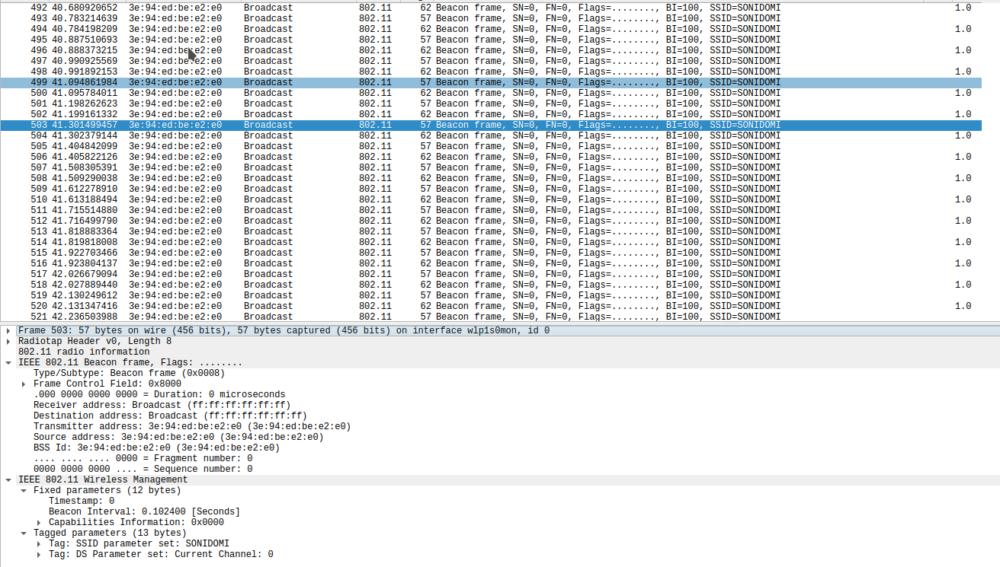

## SSID flood attack

**Fonctionnement**

Pour l'utilisation du script, nous avons ajouté l'interface comme argument et un paramètre facultatif pour ajouter le fichier avec les ssid:

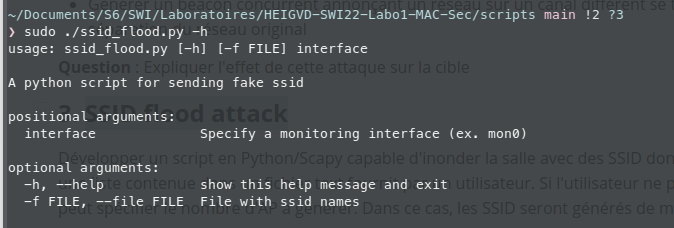

Si l'utilisateur n'ajoute pas de fichier en paramètre, il doit spécifier le nombre de AP qu'il souhaite générer:


Pour chaque paquet envoyé, une adresse MAC de l'AP est générée aléatoirement avec la classe `RandMAC()` et un ssid est également généré aléatoirement. Nous avons décidé de générer un string minuscule de 10 caractères alphabétiques. 

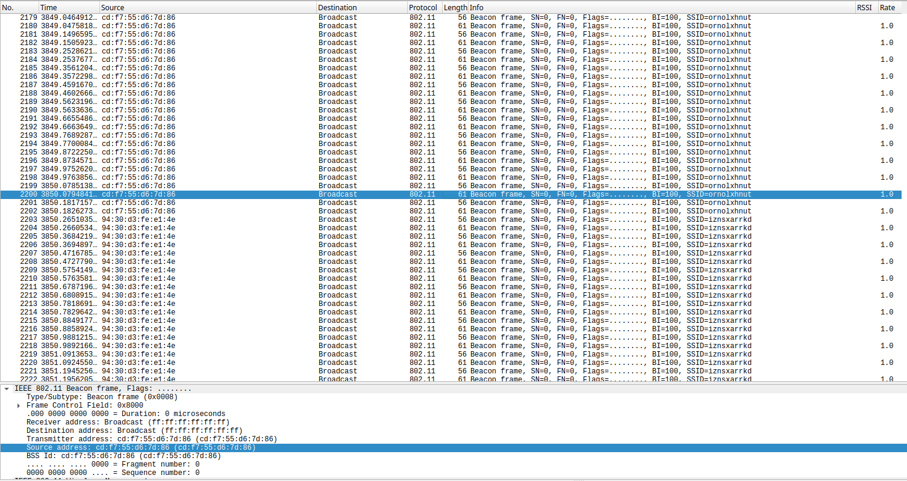

La deuxième option du script permet à un utilisateur d'ajouter un fichier avec des ssid à l'intérieur et pour chaque nom, un AP sera généré. Le contenu du fichier de l'exemple ci-dessous est:

```sh
hello
how
smile
```

La commande avec le fichier en paramètre:


Avec la capture ci-dessous, nous pouvons voir les 3 différents AP avec des adresses MAC générées aléatoirement. Nous pouvons également voir les 3 ssid du fichier.

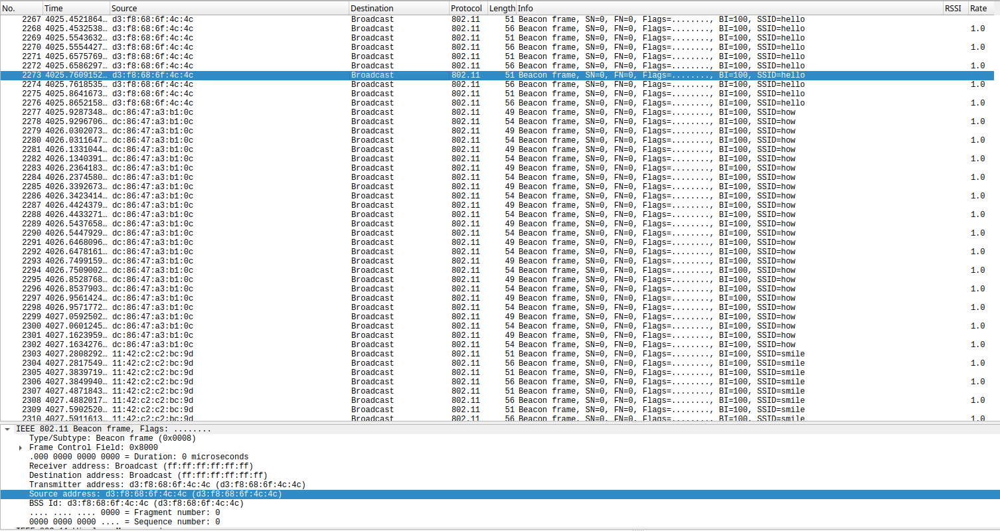

## Probe Request Evil Twin Attack

**Question** : comment ça se fait que ces trames puissent être lues par tout le monde ? Ne serait-il pas plus judicieux de les chiffrer ?

Ces trames doivent pouvoir être accessibles par tout le monde puisque c'est le système utilisé pour détecter les Wi-Fi aux alentours.

**Question** : pourquoi les dispositifs iOS et Android récents ne peuvent-ils plus être tracés avec cette méthode ?

Parce que le MAC est désormais randomisé à chaque connexion.

------

**Fonctionnement** 

Voici les arguments obligatoires:


Il faut d'abord écrire la commande `sudo ./script.py wlan0 "HEIG-VD"` où `HEIG-VD` indique le SSID que l'ont cherche.
Voici le résultat : 


## Détection de clients et réseaux

a) Développer un script en Python/Scapy capable de lister toutes les STA qui cherchent activement un SSID donné

**Fonctionnement**

Nous avons ajouté l'interface ainsi que le ssid à chercher en arguments du script:

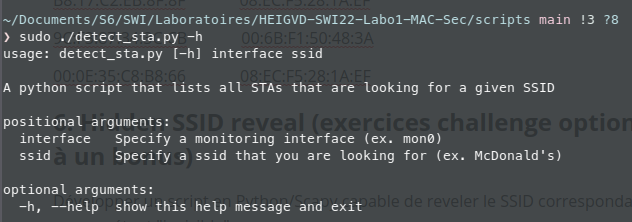

Ainsi, nous avons lancé le script en cherchant le ssid `HEIG-VD`:


------

b) Développer un script en Python/Scapy capable de générer une liste d'AP visibles dans la salle et de STA détectés et déterminer quelle STA est associée à quel AP. Par exemple :

**Fonctionnement**

Nous avons ajouté l'interface en argument du script:


Ainsi, pour lancer le script il faut taper la commande suivante : 

```sh
sudo ./link_sta_ap.py wlan0
```

Voici le résultat : 

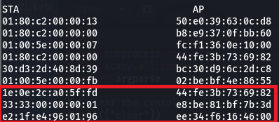

On confirme le résultat en faisant un airodump sur la même interface afin de vérifier le BSSID correspondant à une des STA : 

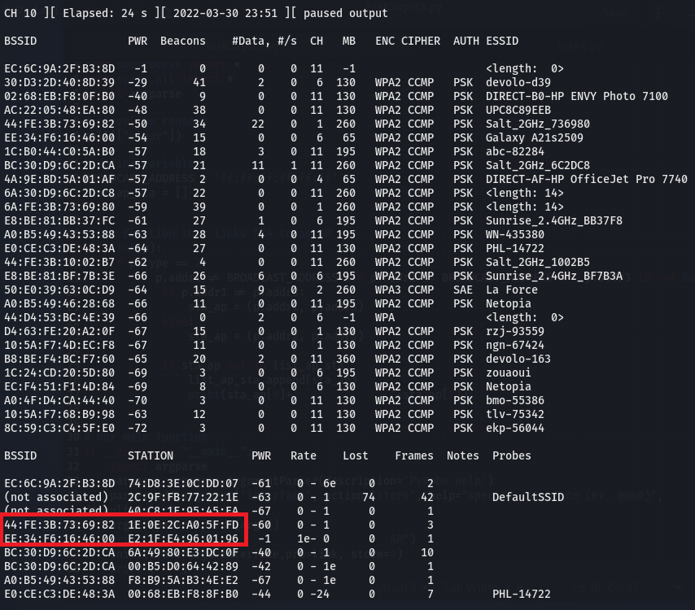

## Hidden SSID reveal

**Question** : expliquer en quelques mots la solution que vous avez trouvée pour ce problème ?


------

**Fonctionnement**

Nous avons ajouté l'interface comme argument du script:


